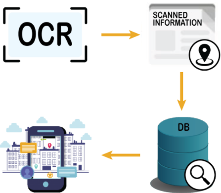
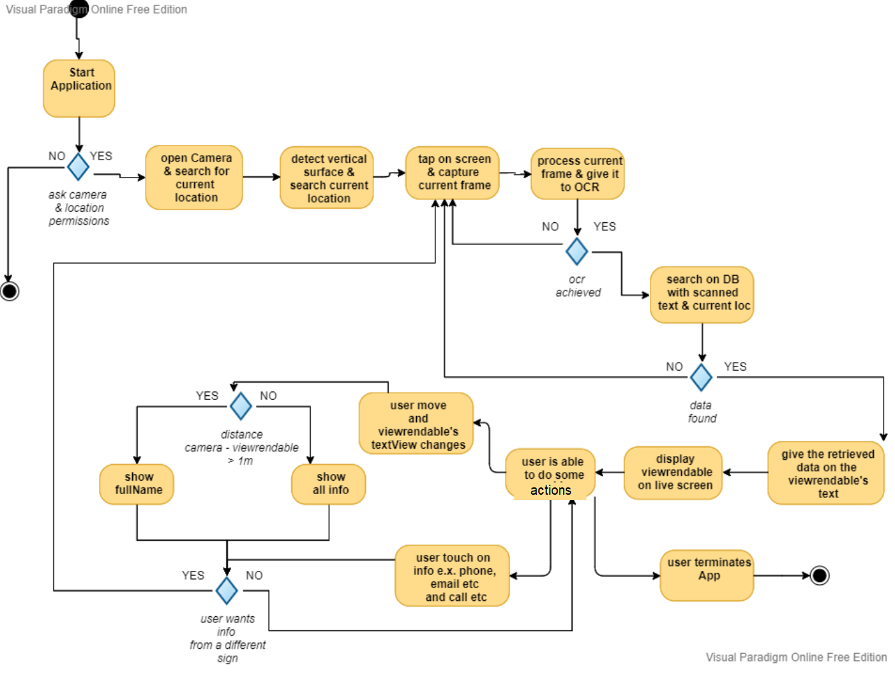
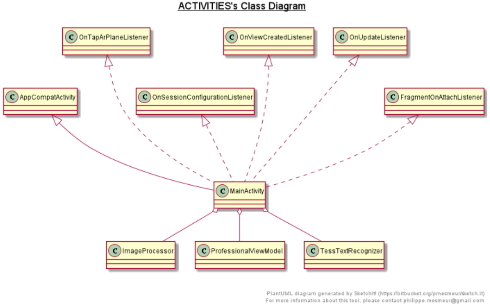
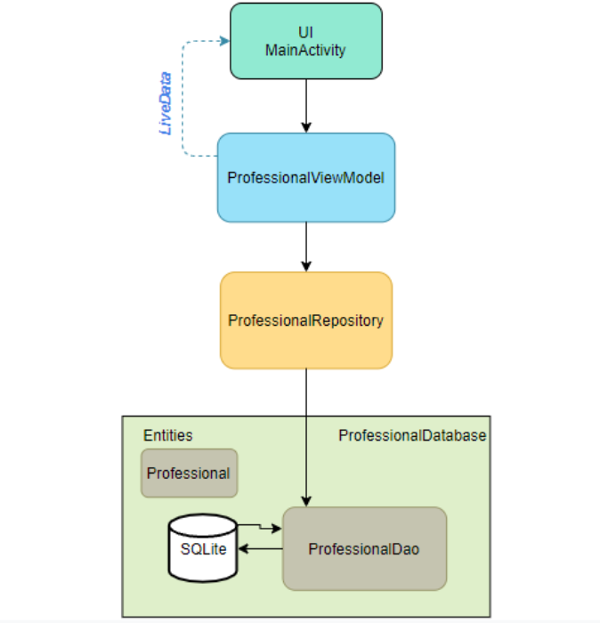
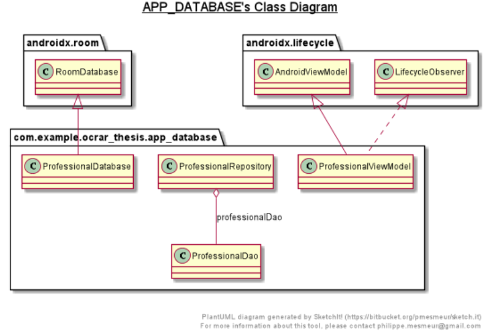
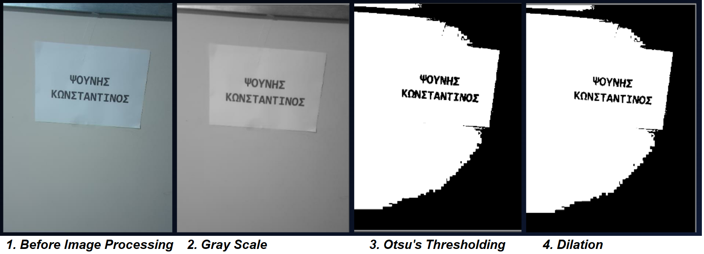

# MEng-Thesis
## AR Android App - Information Retrieval using optical character recognition and display it using augmented reality
*In the folder Report/ you can find a detailed report and a presentation in greek*

In this application the user can retrieve information about professionals (e.g. doctors) and interact with them via a virtual signage using AR. To retrieve the correct data, the user scans signages found on buildings with their smartphone. In addition, optical character recognition is performed to find the professional's last name on the signage . After the succesful OCR a search on a local database follows that is based on the scanned last name and user's current location (essential to avoid mistakes because of duplicate surnames).
## Video Example
https://user-images.githubusercontent.com/25778156/144503465-3f60c159-bba0-4588-a32c-373f05843df8.mp4

## Brief description

### Goal of the thesis 
* Implementation of an innovative and interactive Android application.
* Information retieval from signages that can be found outside or inside buildings.
* Search using Optical Character Recognition.
* Display of information using Augmented reality

### Brief description of the app
* Signage scan
* OCR
* Seach on the database (by recognized surname and user's current location to avoid wrong data because of duplicate surnames)
* Desplay information in real-time on an AR signange

## The project in detail
People are always looking to obtain information most efficiently and effectively. Information on street signs or buildings may seem useful but most of the time, are not
sufficient for the users. In addition to this limited information, the help of modern technologies such as **Optical Character Recognition** and **Augmented Reality** are able to solve the previously mentioned problems. Such advanced technologies provide the users an interactive application for retrieving information and using it in real time. Thus, allowing users to retrieve further information easily and quickly.

**This thesis** hence aims to overcome the information issues faced by users by developing an application in **Android Studio** for smart phones users. The application enables users to search for information about professionals such as doctors or lawyers that are located in Athens. Users are simply required to scan keywords from relevant **signages**. 

The **specific data** will be produced by **vrisko.gr** through scrapping techniques using **Scrappy Framework**. The data is then stored in a local database, **SQLlite**, and is managed using the **Room library**.

When a user is in the city and find a signage of a professional that he is interested in, he can scan the displayed signage with **one touch on the screen** and in **real time** access the desired information through an **interactive virtual augmented reality signage**. The whole process is performed using an OnTapArPlaneListener that is activated every time the user taps on the screen.

The well-known **Tesseract OCR engine** is used for the **optical character recognition** function as well as some **image processing algorithms** with the help of the **OpenCV** library so that the best possible results are obtained. 

In regard to the accuracy of the information retrieved, a search in the database is performed with the surname of the professional and the most **recent location** of the user. **The location is necessary to avoid errors due to possible duplicate data such as professionals with the same surnames.** 

For the **interactive part of augmented reality**, **ARCore** and **Sceneform** were used, which allow the installation of 3D models without the use of pure OpenGL. Specifically, a Viewrendable is used as an anchor and is located at the point where users click on their smartphones.

Moreover, **experiments** such as a "professional building simulation" were performed to test the proper operation of the application and to ensure its accuracy. The application aims to offer the user its simplicity and ease of use combined with the full efficiency provided by a series of complex backend processes. The simple UI and the interactive interface of the application offer the user the possibility to call, send an email, access the website of each professional and receive more information by clicking on a virtual signage. This process can be done repeatedly on different signs easily and without any inconvenience. In addition, this application can also be further developed or extended to offer its audience a smart and fast tool that can be used to facilitate their daily lives for other forms of information retrieval.

## Activity Diagram 

## UML Main Activity

## Data scraping from vrisko.gr 

## SQLite DB

## Diagram of Room's related classes

## UML DB classes

## Image Processing example

## Important classes 

### MainActivity
* Scan Signage when user tap on screen 
* Search in the database for the corresponding surname word by word of the scanned text
* Display Virtual AR signage and change included text depending on the distance bettween the user and the signane in the real-world 

### ImageProcessor Class
* Conversion of YUV420 current frame to Bitmap
* Conversion of the frame to Gray Scale
* Blur the frame via GaussianBlur and MedianBlur.
* Otsu's Thresholding to the frame
* Dilation of the bitmap 

Ideas for the above image processing techniques came from here https://tesseract-ocr.github.io/tessdoc/ImproveQuality.html

### TessTextRecognizer Class
* Tesseract OCR initialization for greek characters

### LocationMatcher Class
* Find latitude and longitude of all possible addresses of professionals of the same surname, use of Geocoder
* Find distance between user's last location and the corresponding address of the "scanned" professional that is in the database

